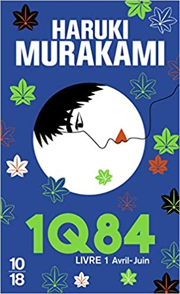

Cela faisait déjà quelques temps que ce livre était posé sur une étagère de ma bibliothèque. J’avais entendu dire beaucoup de bien de cette oeuvre en 3 volumes mais parfois l’enthousiasme de mes amis me refroidit un peu ! J’ai lu “Kafka sur le rivage” du même auteur il y a quelques années et j’avais beaucoup apprécié ce livre. J’hésitais cependant et me lancer, peut être un peu effrayé à l’idée d’enchaîner les autres tomes dans le cas où je prendrais du plaisir dans la lecture de ce premier volume. Bref, ça y est, j’ai extrait le livre de ma bibliothèque et me suis lancé dans sa lecture.

1Q84, c’est l’histoire de 2 personnages principaux que l’on suit dans des chapitres rigoureusement alternés. Tengo est un jeune trentenaire solitaire, professeur de mathématiques et passionné de d’écriture. Aomamé, de son côté mène une double vie de professeur d’arts martiaux et tueuse à gage pour le compte d’une vieille dame. Bien sûr les 2 histoires présentent des points d’accroche que je ne vais pas dévoiler ici. Tengo va devoir réécrire le roman d'une jeune fille tandis que Aomamé, de son côté, doit s'assurer d'exécuter correctement le contrat commandité par la vieille dame.

On navigue entre thriller et fantastique avec une résonance particulière avec l’actualité. Ce qui est le plus fascinant est que ce livre a été écrit au début des années 2010, que l’action se passe en 1984 et que les thèmes abordés sont très actuels. Le sujet de la violence faite aux femmes revient régulièrement et cela ne rend d’ailleurs l’héroïne principale, Aomamé, que plus sympathique...

Bien qu’au départ je ne suis pas du tout amateur de ce genre de livre, je me suis très vite laissé emporter par les 2 histoires alternées. Il faut le reconnaître, le style du Murakami, constitué de phrases courtes, apporte une fluidité incroyable à l’histoire, rendant la lecture très facile. On enchaîne les pages sans effort et les descriptions concises permettent de s’immerger totalement dans l’histoire des deux héros. On s'attache à ses deux personnages et l'envie dans savoir plus, de connaître la suite de l'histoire ont gommés toutes les réticences que je pouvais avoir au début du livre. J'ai ainsi passé un moment agréable à la lecture de ce livre.

## Ce que j’ai aimé

- Le style fluide qui rend la lecture aisée
- Comme pour tous les livres de Murakami, de nombreux passages sont très poétiques
- L'histoire a une résonance particulière avec l'actualité (sans virus !)

## Ce que je n’ai pas aimé

- Rien ne m’a rebuté à la lecture mais le fantastique n’étant pas ma tasse de thé, je vais attendre un peu pour enchaîner sur les volumes suivants. J’ai pourtant envie de connaître la suite !

---

Ma note : ⭐⭐⭐⭐

Édition lue : livre de poche 10/18, traduit du japonais par Hélène Monta

Décembre 2021
