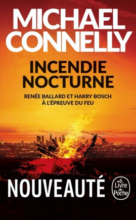

Pour certains auteurs, la question de lire ou non une de leur oeuvre ne se pose pas !  Michael Connelly fait partie de cette catégorie pour ce qui me concerne. Depuis que je l’ai découvert par l’intermédiaire d’un collègue de travail qui m’avait prêté “Le Poète” au milieu des années 2000, je suis resté un lecteur assidu de son oeuvre. Certes il arrive que je sois parfois un peu déçu par certains épisodes mais je retrouve toujours avec plaisir les aventures d’Harry Bosch, Mickey Haller ou depuis peu, Renee Ballard.

Cette fois-ci, il s’agit de la livraison de 2019 : Incendie Nocturne (Night Fire). C’est le 22ème épisode des aventures d’Harry Bosch et le troisième avec Renee Ballard. Nous y croisons aussi Mickey Haller, l’avocat, demi-frère d’Harry Bosch. Dans ce livre nous naviguons entre 3 affaires sur lesquelles les 3 protogonistes principaux vont intervenir à des degrés différents. Cependant, la majeure partie de l’action est centrée sur Renee Ballard qui prend au fil des romans une place de plus en plus importante.

Lors de l’enterrement d’un ancien inspecteur qui fut le mentor de Bosch, sa veuve confie à Harry un livre de meurtre retrouvé dans les affaires du défunt. Bosch fait appel à Ballard pour l’aider à éclaircir le mystère du vol de ce dossier par l’ancien flic. De son côté Ballard est occupée par le décès d’un sans abri dans l’incendie de sa tente. Haller quand à lui doit défendre un schizophrène présumé coupable de l’assassinat d’un juge. 3 faits apparemment très distincts mais qui vont révéler quelques points communs.

Comme à chaque fois avec Connelly, je ne suis pas surpris. Je passe un bon moment de lecture et me laisse porter facilement par l'histoire toujours bien racontée avec sa dose de rebondissements, de tension et des personnages principaux toujours très attachants. Mais il y a bien longtems que Connelly ne me surprend plus et que je ressort de la lecture avec une pointe de déception même si cette fois, l'importance grandissante de Ballard m'a bien plu. Et bien sûr, je continuerai à suivre assidument les prochaines aventures des héros de Connelly !

### Ce que j’ai aimé

- La présence des 3 personnages chers à Connelly, Bosch, Haller et Ballard
- Les 3 différentes affaires qui s’entrecroisent
- Le crépuscule de Bosch en filigrane et la place de plus en plus important prise par Ballard

### Ce que je n’ai pas aimé

- Rien de particulier si ce n'est le manque de surprise qui devient habituel avec Connelly

---

Ma note : ⭐⭐⭐⭐

Édition lue : Le Livre de Poche

Décembre 2021
